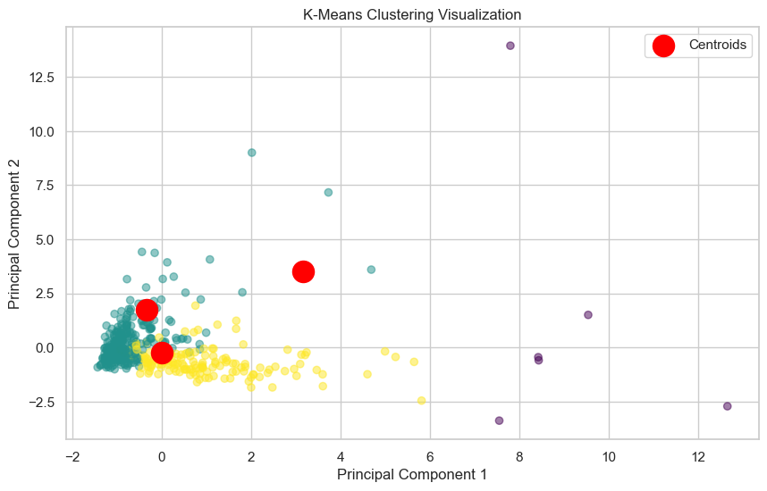
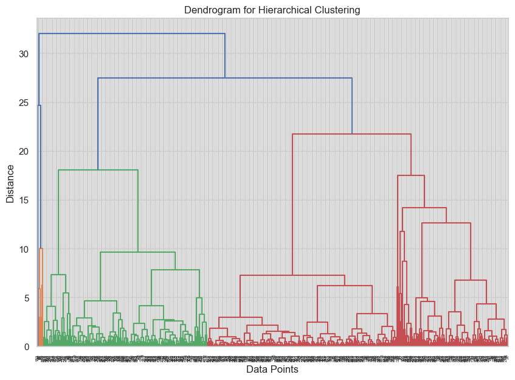
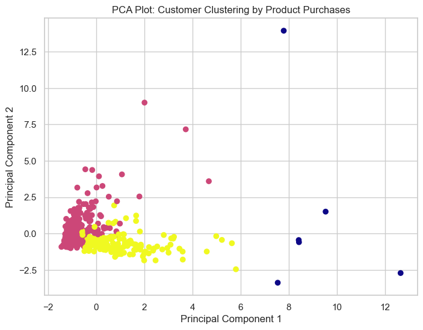

# machine_learning_project-unsupervised-learning

## Project Outcomes
- Unsupervised Learning: perform unsupervised learning techniques on a wholesale data dataset. The project involves four main parts: exploratory data analysis and pre-processing, KMeans clustering, hierarchical clustering, and PCA.
### Duration:
Approximately 1 hour and 40 minutes
### Project Description:
In this project, we will apply unsupervised learning techniques to a real-world data set and use data visualization tools to communicate the insights gained from the analysis.

The data set for this project is the "Wholesale Data" dataset containing information about various products sold by a grocery store.
The project will involve the following tasks:

-	Exploratory data analysis and pre-processing: We will import and clean the data sets, analyze and visualize the relationships between the different variables, handle missing values and outliers, and perform feature engineering as needed.
-	Unsupervised learning: We will use the Wholesale Data dataset to perform k-means clustering, hierarchical clustering, and principal component analysis (PCA) to identify patterns and group similar data points together. We will determine the optimal number of clusters and communicate the insights gained through data visualization.

The ultimate goal of the project is to gain insights from the data sets and communicate these insights to stakeholders using appropriate visualizations and metrics to make informed decisions based on the business questions asked."

### Project Develop:
This project combining exploratory data analysis (EDA) with unsupervised learning techniques. Here’s a brief summary of the next steps to ensure you achieve this goal:

1. Exploratory Data Analysis (EDA) and Pre-processing:

- Import and clean the dataset.
- Handle missing values and outliers.
- Visualize relationships between variables (e.g., using scatter plots, heatmaps).
- Feature engineering.

2. Unsupervised Learning:

- K-Means Clustering: Determine the optimal number of clusters (e.g., using the Elbow method), perform clustering, and visualize results.
- Hierarchical Clustering: Use dendrograms to determine cluster groupings and interpret hierarchical relationships.
- PCA: Reduce dimensions and explore which features contribute most to variance in customer purchases.

3. Communication of Insights:

- Use visualizations like scatter plots, dendrograms, and PCA plots to highlight patterns and cluster groupings.
- Provide key metrics and findings in a concise format for stakeholders to make informed decisions.

### Key Metrics and Findings for Stakeholders
After generating the visualizations, summarize your insights clearly and concisely:

## Cluster Interpretations:

- K-Means Results: "We identified 3 distinct customer groups based on their purchasing behavior. Group 1 is characterized by high purchases of grocery and detergents, Group 2 focuses more on fresh and frozen products, while Group 3 shows balanced spending across all categories."
- Key Metric: "Silhouette Score of 0.56 indicates well-separated clusters."

## Hierarchical Clustering:

- Interpretation: "Hierarchical clustering confirms the distinct groups observed in K-Means. The dendrogram shows that customers first split into groups based on 'Fresh' and 'Frozen' product purchases."
- Key Metric: "Based on the dendrogram, we recommend splitting the customers into 3 major clusters."

## PCA:

- Interpretation: "Principal Component Analysis reveals that most of the variance in the data can be explained by 'Grocery', 'Milk', and 'Detergents_Paper' product categories. These categories heavily influence customer segmentation."
- Key Metric: "The first two principal components explain 65% of the total variance, providing a clear two-dimensional visualization of customer behavior."

## Conclusion

PCA Loadings:
                        PC1       PC2       PC3       PC4       PC5       PC6
Fresh             0.042884  0.527932 -0.812257 -0.236686 -0.048683 -0.036025
Milk              0.545118  0.083168  0.060388 -0.087190  0.826579 -0.038040
Grocery           0.579256 -0.146088 -0.108384  0.105987 -0.314999  0.721745
Frozen            0.051189  0.611278  0.178386  0.768683 -0.027932 -0.015637
Detergents_Paper  0.548640 -0.255233 -0.136192  0.171744 -0.339640 -0.685894
Delicassen        0.248682  0.504207  0.523904 -0.552065 -0.314701 -0.075134

First Principal Component (PC1): The Grocery, Detergents_Paper, and Milk variables have high positive loadings on PC1, indicating that these three features contribute the most to the overall variance captured by this component. This suggests a strong relationship between these product categories in customer purchasing behavior.

Second Principal Component (PC2): The Fresh and Frozen variables contribute significantly to PC2. This component may represent a distinct purchasing pattern related to fresh and frozen goods, separate from the behavior captured in PC1.

Product Grouping: The results of PCA reveal that Milk, Grocery, and Detergents_Paper tend to be purchased together, while Fresh and Frozen products form another group, suggesting that customer purchasing behavior can be described by these distinct product groupings.

These findings help to uncover patterns in customer purchases and can guide strategies for targeted marketing or inventory management.